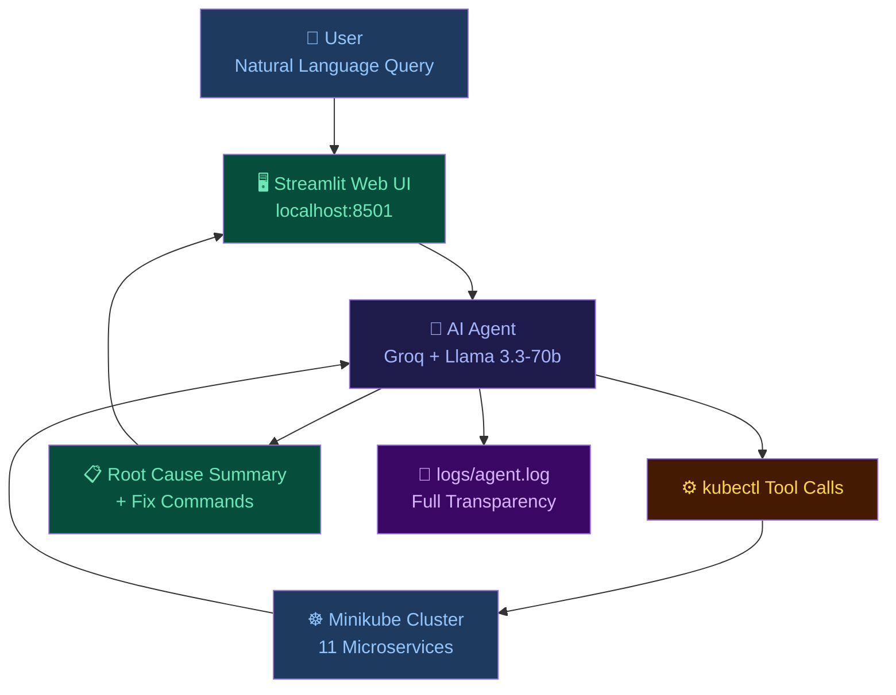
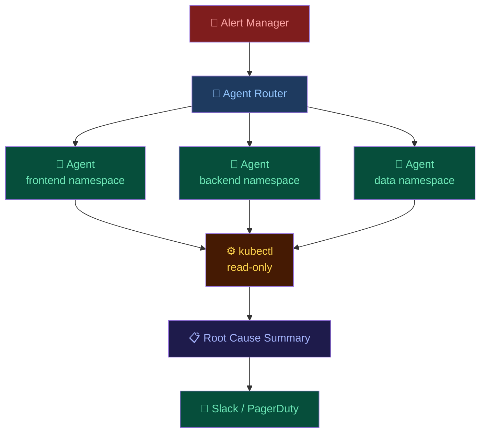

cat > ~/Rakshitha-cpu-H2H-Bright-Bits-Agentic-AI-Ops-Assistant-for-Kubernetes-Clusters/README.md << 'EOF'
# ☸️ Agentic AI Ops Assistant for Kubernetes Clusters

<div align="center">


**An AI-powered web assistant that monitors, diagnoses, and recommends fixes for a local Kubernetes cluster using natural language.**

</div>

---

## 📌 Project Overview

Submission for **H2H Bright Bits Hackathon** — AI/DevOps category.

- 🔍 Accepts natural language queries about your cluster
- ⚙️ Autonomously runs kubectl commands to gather data
- 🧠 Reasons over the output using an LLM
- 🔧 Provides root-cause analysis and exact fix commands
- 💬 Remembers conversation context for follow-up questions
- 📝 Logs every tool call for full transparency

---

## 🏗️ Architecture



---

## ✨ Features

| Feature | Description |
|---------|-------------|
| 🗣️ Natural Language | Ask questions in plain English |
| ⚙️ Auto kubectl | Agent runs commands automatically |
| 🧠 Root Cause Analysis | Explains WHY things are broken |
| 🔧 Fix Commands | Gives exact commands to fix issues |
| 💬 Conversation Memory | Follow-up questions work naturally |
| 📝 Full Logging | Every tool call logged transparently |
| 🖥️ Web UI | Beautiful Streamlit dashboard |
| 🔴 Fault Injection | 4 real faults for realistic testing |

---

## 🧰 Tech Stack

| Component | Technology | Why |
|-----------|------------|-----|
| Local Cluster | Minikube v1.38 | Easy local K8s setup |
| Microservices | Google Online Boutique | Real 11-service app |
| AI Model | Llama 3.3-70b via Groq | Free, fast, accurate |
| Agent Framework | Custom ReAct Loop | Full control |
| Web UI | Streamlit | Fast to build |
| Language | Python 3.12 | Best AI/DevOps support |
| Platform | Ubuntu 24.04 WSL2 | Linux on Windows |

---

## 🤖 Model Choice

**Groq API + llama-3.3-70b-versatile** was chosen because:

- ✅ Completely FREE — no credit card needed
- ✅ Very fast inference — low latency
- ✅ Strong reasoning over kubectl output
- ✅ Handles multi-turn conversation well
- ✅ Understands Kubernetes concepts natively

| Model | Reason Rejected |
|-------|----------------|
| Anthropic Claude | Requires paid credits |
| Google Gemini | Free quota ran out quickly |
| Ollama local | Too slow on 8GB RAM |
| GPT-4 | Requires paid credits |

---

## 💥 Injected Faults

| Fault Type | Resource | Root Cause | Symptom |
|------------|----------|------------|---------|
| CrashLoopBackOff | crashloop-app | Exit code 1 | Restarts forever |
| Pending Pod | pending-pod | Requests 100Gi RAM | Never scheduled |
| Broken Service | broken-service | Wrong selector label | 0 endpoints |
| OOMKilled | oom-pod | Memory limit 50Mi | Killed by OS |

---

## 🚀 Setup Instructions

### Prerequisites
- Windows 11 with WSL2 + Ubuntu 24.04
- Docker installed
- 4 CPU cores, 8GB RAM minimum
- Groq API key — free at console.groq.com

### Step 1 — Start Docker
```bash
sudo dockerd > /dev/null 2>&1 &
```

### Step 2 — Start Minikube
```bash
minikube start --cpus=4 --memory=3000 --driver=docker
```

### Step 3 — Deploy Microservices
```bash
git clone https://github.com/GoogleCloudPlatform/microservices-demo.git
kubectl apply -f microservices-demo/release/kubernetes-manifests.yaml
```

### Step 4 — Inject Faults
```bash
kubectl apply -f faults/faults.yaml
```

### Step 5 — Install Dependencies
```bash
pip3 install -r requirements.txt --break-system-packages
```

### Step 6 — Set API Key
```bash
export GROQ_API_KEY="your-groq-key-here"
```

### Step 7 — Run Web UI
```bash
python3 -m streamlit run ui/app.py
```

### Step 8 — Open Browser
http://localhost:8501

---

## 💬 Demo Conversations

### 1️⃣ Find Broken Pods
You: Which pods are not running and why?
AI:  crashloop-app → CrashLoopBackOff (exit code 1)
pending-pod   → Pending (needs 100Gi RAM)

### 2️⃣ Follow-up Question
You: Why is that happening?
AI:  crashloop-app exits with error code 1.
pending-pod needs 100GB RAM, node has 3GB.

### 3️⃣ Service Diagnosis
You: Is broken-service routing traffic correctly?
AI:  No. Selector points to nonexistent-app.
0 endpoints. Fix selector label.

### 4️⃣ Namespace Follow-up
You: What about the staging namespace?
AI:  staging exists but has no pods running.

### 5️⃣ Fix Everything
You: How do I fix all the issues?
AI:  1. Fix crashloop: kubectl patch deployment...
2. Fix pending: reduce memory to 128Mi
3. Fix service: update selector label

---

## 📝 Transparency Logging
2026-04-19 10:23:01 - USER QUERY: Which pods are not running?
2026-04-19 10:23:01 - TOOL CALL: kubectl get pods
2026-04-19 10:23:02 - TOOL RESULT: NAME READY STATUS...
2026-04-19 10:23:03 - FINAL ANSWER: Two pods not running...

---

## Project Structure

```bash
.
├── agent
│   └── agent.py
├── cluster
│   └── setup.sh
├── faults
│   └── faults.yaml
├── logs
│   └── agent.log
├── ui
│   └── app.py
├── README.md
├── report.md
└── requirements.txt
```
---

## 📈 Scaling to 200+ Services

| Challenge | Solution |
|-----------|----------|
| Too many pods | Vector DB search over metadata |
| Single agent bottleneck | One agent per namespace |
| Slow kubectl calls | Cache results 30 seconds |
| Alert overload | Trigger only on real alerts |
| Security risk | Read-only RBAC service account |

### Production Architecture



---

## 👩‍💻 Author

**Rakshitha R**
GitHub: [@Rakshitha-cpu](https://github.com/Rakshitha-cpu)
Hackathon: H2H Bright Bits — AI/DevOps Track

---

## Team Members
Rakshitha R,
poojary Nisarga Arun

---

## 📄 License

MIT License
EOF
