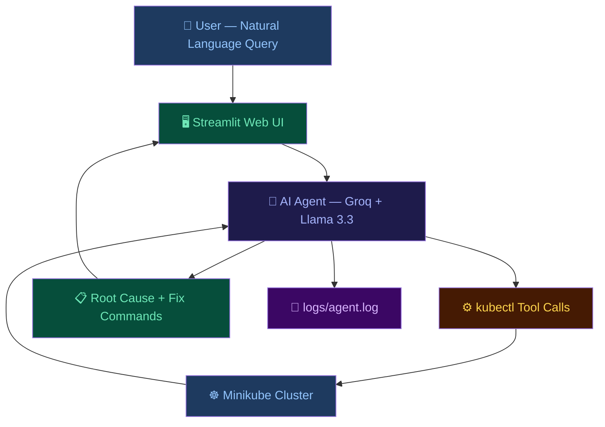
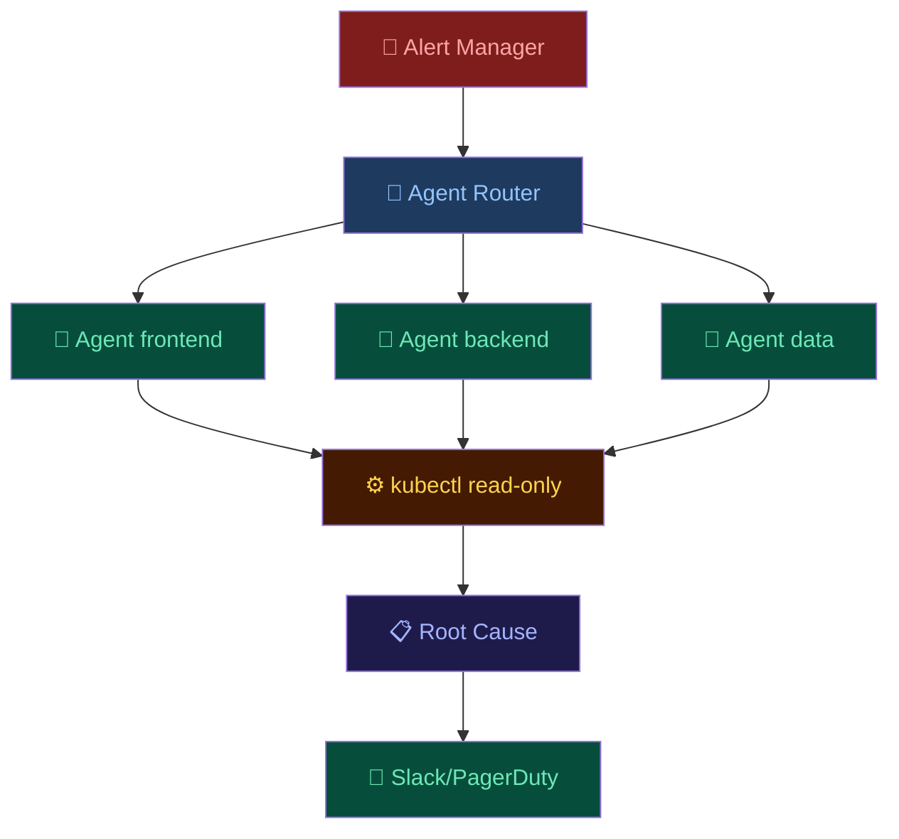

# ☸️ Agentic AI Ops Assistant for Kubernetes Clusters

> AI-powered Kubernetes diagnostics using natural language — just ask, it diagnoses and fixes.

<div align="center">


</div>

---

## 🚨 Problem Statement

Managing Kubernetes clusters is complex and requires deep expertise.
When pods crash, services break, or resources run out — engineers
spend hours manually running kubectl commands, reading logs, and
searching documentation to find the root cause.

**The problem:**
- Kubernetes errors are cryptic and hard to understand
- Debugging requires running 10+ commands manually
- New engineers don't know where to start
- Downtime costs money every minute

---

## 💡 Proposed Solution

An AI-powered assistant that:
- Accepts plain English questions about your cluster
- Automatically runs the right kubectl commands
- Reasons over the output using an LLM
- Returns a clear root-cause explanation + exact fix commands
- Remembers conversation context for follow-up questions

**What makes it unique:**
- No Kubernetes expertise needed — just ask in plain English
- Fully autonomous — no manual command running
- Conversation memory — follow-up questions work naturally
- Complete transparency — every tool call is logged

---

## ✨ Features

- 🗣️ Natural language queries — ask in plain English
- ⚙️ Auto kubectl execution — agent runs commands itself
- 🧠 Root cause analysis — explains WHY things break
- 🔧 Exact fix commands — tells you exactly what to run
- 💬 Conversation memory — follow-up questions work
- 📝 Full transparency logging — every step logged
- 🖥️ Beautiful web UI — dark theme dashboard
- 🔴 Fault injection — 4 real faults for testing
- 📊 Live cluster status — pod counts in sidebar
- ⚡ Quick diagnose buttons — one click diagnosis

---

## 🏗️ Architecture



---

## 🧰 Tech Stack

| Component | Technology | Why |
|-----------|------------|-----|
| Local Cluster | Minikube v1.38 | Easy local K8s |
| Microservices | Google Online Boutique | Real 11-service app |
| AI Model | Llama 3.3-70b via Groq | Free and fast |
| Agent Framework | Custom ReAct Loop | Full control |
| Web UI | Streamlit | Professional UI |
| Language | Python 3.12 | Best AI support |
| Platform | Ubuntu 24.04 WSL2 | Linux on Windows |

---

## 🤖 Model Choice

**Groq API + llama-3.3-70b-versatile** chosen because:
- ✅ Completely FREE
- ✅ Fast inference
- ✅ Strong Kubernetes reasoning
- ✅ Multi-turn conversation support

| Model | Reason Rejected |
|-------|----------------|
| Anthropic Claude | Requires paid credits |
| Google Gemini | Free quota ran out |
| Ollama local | Too slow on 8GB RAM |

---

## 💥 Injected Faults

| Fault Type | Resource | Root Cause | Symptom |
|------------|----------|------------|---------|
| CrashLoopBackOff | crashloop-app | Exit code 1 | Restarts forever |
| Pending Pod | pending-pod | Requests 100Gi RAM | Never scheduled |
| Broken Service | broken-service | Wrong selector | 0 endpoints |
| OOMKilled | oom-pod | Memory limit 50Mi | Killed by OS |

---

## 🚀 Setup Instructions

### Prerequisites
- Windows 11 with WSL2 + Ubuntu 24.04
- Docker installed
- 4 CPU cores, 8GB RAM
- Groq API key — free at console.groq.com

### Step 1 — Start Docker
```bash
sudo dockerd > /dev/null 2>&1 &
```

### Step 2 — Start Minikube
```bash
minikube start --cpus=4 --memory=3000 --driver=docker
```

### Step 3 — Deploy Microservices
```bash
git clone https://github.com/GoogleCloudPlatform/microservices-demo.git
kubectl apply -f microservices-demo/release/kubernetes-manifests.yaml
```

### Step 4 — Inject Faults
```bash
kubectl apply -f faults/faults.yaml
```

### Step 5 — Install Dependencies
```bash
pip3 install -r requirements.txt --break-system-packages
```

### Step 6 — Set API Key
```bash
export GROQ_API_KEY="your-groq-key-here"
```

### Step 7 — Run Web UI
```bash
python3 -m streamlit run ui/app.py
```

### Step 8 — Open Browser
http://localhost:8504

---

## 🎥 Demo Video
https://drive.google.com/file/d/1FvAC8UcCVXywcAdCk0zvF85PQiUxkZMy/view?usp=drivesdk

---

## 📸 Screenshots

### Web UI Dashboard


### AI Diagnosis in Action


### Cluster Status Sidebar


### pods


### commands


---

## 💬 5 Diagnostic Conversations

### 1️⃣ Find Broken Pods
You: Which pods are not running and why?
AI:  crashloop-app → CrashLoopBackOff (exit code 1)
pending-pod   → Pending (needs 100Gi RAM)

### 2️⃣ Follow-up Memory Test
You: Why is that happening?
AI:  Remembers context from Question 1 and explains
root causes of those specific pods

### 3️⃣ Service Diagnosis
You: Is broken-service routing traffic correctly?
AI:  No. 0 endpoints. Wrong selector label.
Fix: kubectl edit service broken-service

### 4️⃣ Namespace Follow-up
You: What about the staging namespace?
AI:  staging exists but has no pods running.

### 5️⃣ Fix Everything
You: How do I fix all the issues?
AI:  Complete fix guide for all 3 issues found

---

## 📝 Transparency Logging

The assistant keeps the diagnosis process transparent by logging:
- user queries
- selected kubectl commands
- tool outputs
- final diagnosis summaries

This makes the workflow easier to verify, debug, and trust.

Example log flow:

```text
2026-04-19 10:23:01 | USER QUERY >>> Which pods are not running?
2026-04-19 10:23:01 | PLANNED COMMANDS >>> ['get pods -o wide', 'describe pod crashloop-app', 'describe pod pending-pod', 'get events --sort-by=.lastTimestamp']
2026-04-19 10:23:02 | TOOL CALL >>> kubectl get pods -o wide
2026-04-19 10:23:02 | TOOL RESULT >>> NAME READY STATUS RESTARTS AGE ...
2026-04-19 10:23:03 | FINAL ANSWER >>> The cluster has unhealthy pods because crashloop-app is crashing and pending-pod cannot be scheduled.
```
---
```
📂 Project Structure
.
├── agent/
│   ├── __init__.py
│   └── agent.py
├── cluster/
│   └── setup.sh
├── faults/
│   └── faults.yaml
├── logs/
│   └── agent.log
├── screenshots/
│   ├── dashboard.png
│   ├── diagnosis.png
│   └── sidebar.png
├── ui/
│   └── app.py
├── README.md
├── report.md
└── requirements.txt
```
---

## 📈 Scaling to 200+ Services

| Challenge | Solution |
|-----------|----------|
| Too many pods | Vector DB search |
| Single bottleneck | One agent per namespace |
| Slow kubectl | Cache 30 seconds |
| Alert overload | Trigger on alerts only |
| Security | Read-only RBAC |



---

## 👥 Team Members

| Name | Role | GitHub |
|------|------|--------|
| Rakshitha R | AI Agent + Backend | [https://github.com/Rakshitha-cpu] |
| Poojary Nisarga Arun | Frontend + DevOps | [https://github.com/Nisarga582] |

---

## 🌐 Deployed Link
Public hosted demo of the project interface.  
For full real-time Kubernetes diagnosis, use the localhost version connected to the live Minikube cluster.
https://e7d22gwtb565qppfvaxw3i.streamlit.app/

---

## 📄 License

MIT License — H2H Bright Bits Hackathon 2026
---
⭐ Support
If this project helped you or you find it interesting, please consider giving it a ⭐ — it means a lot!
